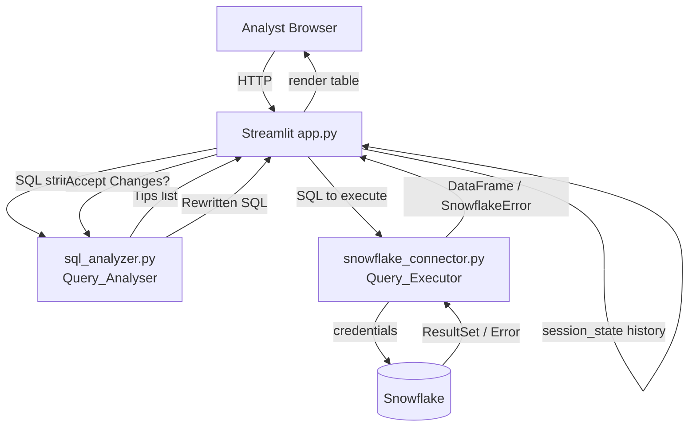

# Design Document: Snowflake Analyst IDE

## Overview

The Snowflake Analyst IDE is a Streamlit web application that acts as a governed gateway between junior analysts and a Snowflake Cloud Data Warehouse. Before any SQL reaches Snowflake, the application intercepts it, analyses it for cost and quality anti-patterns, surfaces actionable tips, and optionally rewrites the SQL. This prevents expensive or poorly-written queries from running unchecked.

The application is structured as:

- `app.py` — Streamlit entry point; all UI rendering and session-state orchestration
- `utilities/sql_analyzer.py` — pure-Python SQL analysis and rewrite logic (no I/O)
- `utilities/snowflake_connector.py` — Snowflake connection management and query execution
- `tests/` — pytest test suite with mocked Snowflake

The separation of all helper logic into `utilities/` keeps the Streamlit layer thin and makes every critical path independently testable without a live Snowflake instance.

---

## Architecture



### Request Lifecycle

1. Analyst writes SQL in the Query_Editor and clicks **Submit**.
2. `app.py` passes the SQL to `sql_analyzer.analyze(sql)` → returns a list of `Tip` objects.
3. If tips exist, the IDE renders them and waits for the Analyst to **Accept Changes** or **Dismiss**.
4. If accepted, `sql_analyzer.rewrite(sql, tips)` produces the rewritten SQL.
5. The final SQL (original or rewritten) is passed to `snowflake_connector.execute(sql)`.
6. The result `DataFrame` (or error) is rendered by the Result_Renderer section of `app.py`.
7. On success, the SQL and timestamp are appended to `st.session_state.history`.

---

## Components and Interfaces

### `utilities/sql_analyzer.py`

```python
from dataclasses import dataclass
from typing import List

@dataclass
class Tip:
    code: str          # e.g. "MISSING_LIMIT", "SELECT_STAR", "MISSING_WHERE", "CARTESIAN_JOIN"
    message: str       # human-readable suggestion
    severity: str      # "warning" | "info"

def analyze(sql: str) -> List[Tip]:
    """
    Parse sql with sqlparse and return a list of Tips.
    Returns an empty list when no anti-patterns are found.
    """

def rewrite(sql: str, tips: List[Tip]) -> str:
    """
    Apply all tips to sql and return the rewritten SQL string.
    Rewrites are additive: they never remove intent from the original query.
    """
```

Detection rules (each maps to one `Tip.code`):

| Code | Detection logic |
|---|---|
| `MISSING_LIMIT` | No `LIMIT` token in the top-level SELECT statement |
| `SELECT_STAR` | Wildcard `*` in the SELECT column list |
| `MISSING_WHERE` | Single-table SELECT with no WHERE clause |
| `CARTESIAN_JOIN` | JOIN keyword present but no ON or USING clause follows it |

Rewrite rules:

| Code | Rewrite action |
|---|---|
| `MISSING_LIMIT` | Append `LIMIT 1000` to the query |
| `SELECT_STAR` | Replace `*` with `/* specify columns */ *` comment hint (non-destructive) |
| `MISSING_WHERE` | Append `WHERE TRUE -- add your filter` comment hint |
| `CARTESIAN_JOIN` | Append `/* WARNING: Cartesian join detected */` comment |

### `utilities/snowflake_connector.py`

```python
import snowflake.connector
import pandas as pd
from typing import Optional

def get_connection() -> snowflake.connector.SnowflakeConnection:
    """
    Return the cached Snowflake connection from st.session_state,
    creating it on first call using credentials from env vars or
    Streamlit secrets (st.secrets).
    Required keys: account, user, password, warehouse, database, schema.
    Raises SnowflakeConnectionError on failure.
    """

def execute(sql: str) -> pd.DataFrame:
    """
    Execute sql on the cached connection and return results as a DataFrame.
    Raises SnowflakeQueryError on Snowflake-side errors.
    """
```

Custom exceptions:

```python
class SnowflakeConnectionError(Exception): ...
class SnowflakeQueryError(Exception): ...
```

### `app.py` (Streamlit UI)

Key `st.session_state` keys:

| Key | Type | Purpose |
|---|---|---|
| `sql` | `str` | Current editor content |
| `tips` | `List[Tip]` | Tips from last analysis |
| `rewritten_sql` | `Optional[str]` | Rewritten SQL if accepted |
| `result_df` | `Optional[pd.DataFrame]` | Last query result |
| `history` | `List[dict]` | `[{sql, timestamp}, ...]` ordered newest-first |
| `conn` | `SnowflakeConnection` | Cached connection |

---

## Data Models

### `Tip`

```python
@dataclass
class Tip:
    code: str      # one of the four anti-pattern codes
    message: str   # display string shown to the analyst
    severity: str  # "warning" | "info"
```

### History Entry

```python
{
    "sql": str,           # the SQL that was actually executed (original or rewritten)
    "timestamp": datetime # UTC timestamp of successful execution
}
```

### Query Result

Results are returned as a `pandas.DataFrame`. The Result_Renderer reads:
- `df.shape` → `(row_count, col_count)`
- `df.columns` → column headers (as returned by Snowflake)
- `df.empty` → zero-row detection

### Credential Resolution Order

```
1. st.secrets["snowflake"]   (Streamlit Cloud / secrets.toml)
2. Environment variables:    SNOWFLAKE_ACCOUNT, SNOWFLAKE_USER,
                             SNOWFLAKE_PASSWORD, SNOWFLAKE_WAREHOUSE,
                             SNOWFLAKE_DATABASE, SNOWFLAKE_SCHEMA
```

If neither source provides all six required keys, a `SnowflakeConnectionError` is raised at startup.


---

## Correctness Properties

*A property is a characteristic or behavior that should hold true across all valid executions of a system — essentially, a formal statement about what the system should do. Properties serve as the bridge between human-readable specifications and machine-verifiable correctness guarantees.*

### Property 1: SQL length boundary

*For any* SQL string whose length is ≤ 10,000 characters, the Query_Editor input validation SHALL accept it; for any SQL string whose length exceeds 10,000 characters, the validation SHALL reject it.

**Validates: Requirements 1.2**

---

### Property 2: Empty and whitespace SQL rejection

*For any* string composed entirely of whitespace characters (including the empty string), submitting it as a query SHALL be rejected by the validation layer and the Query_Executor SHALL NOT be called.

**Validates: Requirements 2.2**

---

### Property 3: Result render contains required metadata

*For any* non-empty `pandas.DataFrame` returned by the Query_Executor, the rendered output SHALL contain the exact row count, the exact column count, and every column name present in `df.columns`.

**Validates: Requirements 3.2, 3.4**

---

### Property 4: MISSING_LIMIT detection

*For any* valid SELECT SQL string that contains no top-level LIMIT clause, `sql_analyzer.analyze(sql)` SHALL return a list that includes a `Tip` with `code == "MISSING_LIMIT"`.

**Validates: Requirements 4.2**

---

### Property 5: SELECT_STAR detection

*For any* valid SELECT SQL string that uses `SELECT *` (wildcard column selection), `sql_analyzer.analyze(sql)` SHALL return a list that includes a `Tip` with `code == "SELECT_STAR"`.

**Validates: Requirements 4.3**

---

### Property 6: MISSING_WHERE detection

*For any* valid single-table SELECT SQL string that contains no WHERE clause, `sql_analyzer.analyze(sql)` SHALL return a list that includes a `Tip` with `code == "MISSING_WHERE"`.

**Validates: Requirements 4.4**

---

### Property 7: CARTESIAN_JOIN detection

*For any* valid SQL string that contains a JOIN keyword not followed by an ON or USING clause, `sql_analyzer.analyze(sql)` SHALL return a list that includes a `Tip` with `code == "CARTESIAN_JOIN"`.

**Validates: Requirements 4.5**

---

### Property 8: Rewrite is a structural superset (round-trip equivalence)

*For any* valid SQL string `s` and the tips `T = analyze(s)`, the rewritten SQL `r = rewrite(s, T)`:
1. SHALL address every tip in `T` (i.e., `analyze(r)` returns no tips with codes present in `T`), and
2. SHALL be parseable by `sqlparse`, and
3. The parse tree of `r` SHALL contain all tokens present in the parse tree of `s` (the rewrite is additive — it never removes original intent).

**Validates: Requirements 5.2, 8.6**

---

### Property 9: Missing credentials raise a connection error

*For any* subset of the six required Snowflake credential keys (`account`, `user`, `password`, `warehouse`, `database`, `schema`) that is missing at least one key, calling `get_connection()` SHALL raise a `SnowflakeConnectionError`.

**Validates: Requirements 6.2**

---

### Property 10: Successful query appends to history

*For any* SQL string that executes successfully via `execute(sql)`, the session history list SHALL contain an entry with that exact SQL string and a UTC timestamp that is ≥ the time before the call was made.

**Validates: Requirements 7.2**

---

### Property 11: History is ordered most-recent first

*For any* sequence of N successful query submissions, the history list SHALL be ordered such that `history[0].timestamp >= history[1].timestamp >= ... >= history[N-1].timestamp`.

**Validates: Requirements 7.3**

---

## Error Handling

### Connection Errors

- `get_connection()` raises `SnowflakeConnectionError` when credentials are missing or the Snowflake handshake fails.
- `app.py` catches `SnowflakeConnectionError` at startup and renders `st.error(...)` with the exception message. The Submit button is disabled while no valid connection exists.

### Query Execution Errors

- `execute(sql)` catches `snowflake.connector.errors.ProgrammingError` and re-raises as `SnowflakeQueryError` with the original Snowflake error message preserved.
- `app.py` catches `SnowflakeQueryError` and renders `st.error(...)` below the Submit button. The history list is NOT updated on error.

### Input Validation Errors

- Empty / whitespace-only SQL: caught in `app.py` before calling `analyze()` or `execute()`. Renders `st.warning("Please enter a SQL query.")`.
- SQL exceeding 10,000 characters: caught in `app.py` before calling `analyze()`. Renders `st.warning("Query exceeds the 10,000 character limit.")`.

### Rewrite Errors

- If `rewrite()` raises an unexpected exception (e.g., `sqlparse` parse failure), `app.py` catches it, logs the traceback, and falls back to submitting the original SQL with a `st.warning(...)` notice to the Analyst.

---

## Testing Strategy

### Dual Testing Approach

Both unit tests and property-based tests are required. They are complementary:

- **Unit tests** verify specific examples, integration points, and error conditions.
- **Property tests** verify universal properties across many randomly generated inputs.

### Unit Tests (`tests/test_sql_analyzer.py`, `tests/test_snowflake_connector.py`)

Focus areas:
- Each anti-pattern detection function with concrete SQL examples (one passing, one failing per rule).
- Rewrite output for each anti-pattern with a known input/output pair.
- `get_connection()` with a mocked `snowflake.connector.connect` — success path and failure path.
- `execute()` with a mocked cursor — success path, `ProgrammingError` path.
- History append and ordering with a small fixed sequence of queries.
- Zero-row result rendering (edge case from Requirement 3.3).
- Credential resolution from env vars vs. mock `st.secrets` dict.
- Connection reuse: calling `get_connection()` twice returns the same object (mock session_state).

All Snowflake connections MUST be mocked using `unittest.mock.patch` so tests run without a live Snowflake instance.

### Property-Based Tests (`tests/test_properties.py`)

Library: **Hypothesis** (Python property-based testing library).

Each property test runs a minimum of **100 iterations** (configured via `@settings(max_examples=100)`).

Each test is tagged with a comment in the format:
`# Feature: snowflake-analyst-ide, Property {N}: {property_text}`

| Test | Property | Hypothesis Strategy |
|---|---|---|
| `test_sql_length_boundary` | Property 1 | `st.text(min_size=0, max_size=12000)` |
| `test_empty_whitespace_rejection` | Property 2 | `st.text(alphabet=st.characters(whitelist_categories=("Zs","Cc")))` |
| `test_render_metadata` | Property 3 | `st.data_frames(...)` from `hypothesis[pandas]` |
| `test_missing_limit_detection` | Property 4 | Generated SELECT SQL without LIMIT |
| `test_select_star_detection` | Property 5 | Generated `SELECT * FROM <table>` SQL |
| `test_missing_where_detection` | Property 6 | Generated single-table SELECT without WHERE |
| `test_cartesian_join_detection` | Property 7 | Generated JOIN SQL without ON/USING |
| `test_rewrite_superset` | Property 8 | Any SQL string that `analyze()` returns tips for |
| `test_missing_credentials_error` | Property 9 | `st.sets(st.sampled_from([...6 keys...]), max_size=5)` |
| `test_history_append` | Property 10 | `st.lists(st.text(min_size=1), min_size=1)` |
| `test_history_ordering` | Property 11 | `st.lists(st.text(min_size=1), min_size=2)` |

### Test File Structure

```
tests/
  conftest.py              # shared fixtures: mock connection, mock session_state
  test_sql_analyzer.py     # unit tests for analyze() and rewrite()
  test_snowflake_connector.py  # unit tests for get_connection() and execute()
  test_properties.py       # all Hypothesis property-based tests
```

### Dependencies

```
pytest
hypothesis[pandas]
unittest.mock  # stdlib
```
